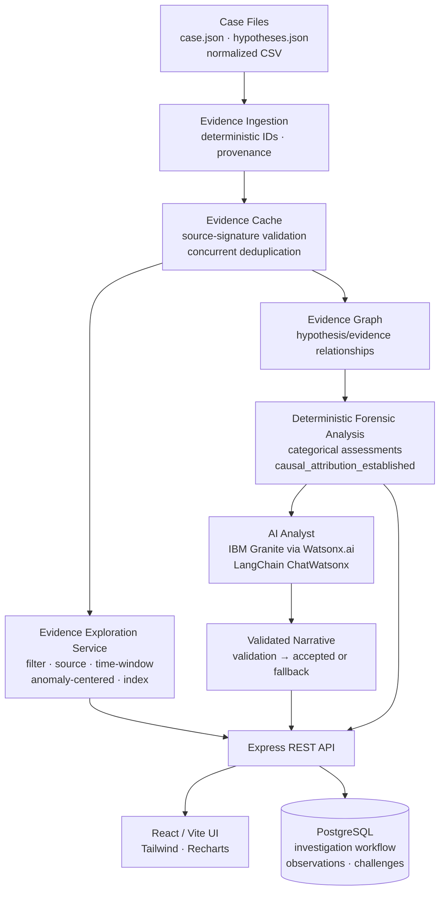

# SpaceForensics

Evidence-grounded forensic analysis for unexpected spacecraft events.

SpaceForensics ingests multi-source observational data, constructs a structured evidence graph, runs deterministic forensic assessment across competing hypotheses, and then — and only then — supplies that validated analysis to an AI analyst for narrative explanation. The AI explains the forensic findings. It does not produce them.

---

## Why SpaceForensics?

Satellite anomaly investigations combine observations from multiple sensor streams (different instruments, resolutions, and time bases), spacecraft metadata, environmental context, and competing physical hypotheses. The data is noisy, incomplete, and temporally non-uniform.

A conventional LLM handed raw space weather data will produce fluent, confident-sounding causal explanations with no reliable relationship to the evidence. It correlates co-occurring events and presents association as mechanism. It cannot self-falsify. It cannot flag missing data. It cannot hold a hypothesis as `insufficient_evidence` when evidence is genuinely absent.

SpaceForensics is designed around that specific problem. It separates:

- **Observed evidence** — what the instruments actually recorded
- **Environmental context** — conditions present near the anomaly time
- **Deterministic forensic assessment** — categorical hypothesis evaluations with explicit evidence citations
- **AI-generated explanation** — constrained narrative downstream of validated analysis
- **Provenance** — which dataset, provider, and variable each record came from
- **Uncertainty** — explicit limitations on every hypothesis
- **Case boundaries** — strict isolation between different spacecraft investigations

---

## The core architectural idea

**The AI is constrained by the forensic system, not the other way around.**

The forensic analysis pipeline runs first, deterministically, from the evidence files. The pipeline produces categorical hypothesis assessments (`supported`, `mixed`, `insufficient_evidence`, `strongly_supported`) and a `causal_attribution_established` boolean. Those outputs are validated before the LLM ever sees them. The LLM receives the validated analysis as structured input and is permitted only to explain it — not to change it, contradict it, introduce unsupported evidence IDs, or claim numerical probability values.

If LLM output fails validation, the system falls back to a deterministic heuristic narrative. The evidence-grounded result always reaches the consumer.

```
Case Files
    ↓
Evidence Ingestion (deterministic IDs + provenance)
    ↓
Evidence Graph (hypothesis/evidence relationships)
    ↓
Deterministic Forensic Analysis
    ↓
AI Analyst (explains validated analysis)
    ↓
Validated Narrative
    ↓
REST API → React UI
```

---

## Galaxy 15 reference investigation

Galaxy 15 is a geostationary communications satellite operated by Intelsat. On **2010-04-05 at 09:48 UTC**, it became unresponsive to all ground commands during disturbed geomagnetic and energetic-particle conditions. It continued transmitting — transponders active, attitude control nominal — but did not respond to the uplink for nine months before autonomously recovering on 2010-12-26. The causal mechanism was never definitively established.

This investigation is the frozen v1.0.0 release baseline.

### Evidence summary

| Source | Instrument | Variable | Resolution | Records |
|---|---|---|---|---|
| `GOES11_EP8` | GOES-11 Energetic Particle Sensor | Electron flux >2 MeV | 5 min | 36 |
| `GOES11_MAG` | GOES-11 Magnetometer | B-field GSM (nT) | 1 min | 180 |
| `GOES11_EPHEMERIS` | GOES-11 SSC Ephemeris | Orbital radius (Re) | 3 min | 61 |
| `CASE` | Anchor event | Command loss timestamp | Event | 1 |
| **Total** | | | | **278** |

- Evidence IDs: `E-G15-0001` through `E-G15-0278`
- Data window: `2010-04-05T08:00:00Z` → `2010-04-05T11:00:00Z`
- `causal_attribution_established: false`

### Hypothesis assessments

| ID | Hypothesis | Assessment |
|---|---|---|
| H1 | Spacecraft charging / electrostatic discharge | `mixed` |
| H2 | Single-event electronic upset / latchup | `mixed` |
| H3 | Command receiver / command-processing fault | `supported` |
| H4 | Ground segment / RF link anomaly | `insufficient_evidence` |
| H5 | Insufficient evidence for causal attribution | `strongly_supported` |

These assessments are categorical, not probabilistic. No numerical probability values are assigned or claimed. H5 being `strongly_supported` reflects that the available environmental evidence does not establish a mechanism — it is a forensically honest result, not an engineering failure.

---

## Architecture



---

## Scientific integrity

These safeguards are enforced in code, not just policy:

- **No unsupported causal attribution** — `causal_attribution_established` is a boolean controlled entirely by the forensic analysis pipeline; it cannot be set by the AI layer.
- **Environmental context ≠ mechanism confirmation** — GOES-11 measurements document what conditions existed near the anomaly time; they do not confirm a specific physical mechanism.
- **AI cannot invent evidence IDs** — the AI validator checks that every evidence ID cited in the AI output actually exists in the case's parsed evidence set.
- **AI cannot change deterministic assessments** — hypothesis assessments in AI output are validated against the forensic analysis results; a mismatch triggers fallback.
- **No numerical probability claims** — the AI validator rejects any output containing percentage figures or explicit probability language.
- **Missing evidence stays missing** — data gaps in the source datasets are not filled, averaged, or explained away.
- **Cross-case isolation** — evidence IDs, graph entries, and cache entries are strictly scoped per `caseId`; no data bleeds between investigations.

---

## AI architecture

AI capability depends on environment configuration. The system is designed to degrade gracefully.

- **LLM**: IBM Granite 3.3 8B Instruct (`ibm/granite-3-3-8b-instruct`)
- **Platform**: IBM Watsonx.ai (`us-south.ml.cloud.ibm.com` by default)
- **Client**: LangChain `ChatWatsonx` from `@langchain/ibm`
- **Credentials**: `WATSONX_AI_APIKEY`, `WATSONX_AI_PROJECT_ID`, `WATSONX_AI_URL` (all optional — no key means no LLM calls)

**Flow:**

1. Deterministic forensic analysis runs from evidence files — no AI involved.
2. Validated analysis is passed as structured input to the AI analyst.
3. The AI is asked to produce a structured JSON narrative explaining the validated findings.
4. The response is validated against the forensic results (evidence IDs, assessment values, causal attribution, no probabilities, no causal certainty language).
5. A valid response is used; an invalid response triggers heuristic fallback — the deterministic result still reaches the consumer.

The AI cannot access the evidence files directly. It receives only what the forensic pipeline has already assessed.

---

## Evidence exploration API

All endpoints are read-only. Evidence data is served from the in-memory evidence cache.

**Case and evidence retrieval**

| Method | Path | Description |
|---|---|---|
| `GET` | `/api/cases` | List all available cases |
| `GET` | `/api/cases/:id` | Case metadata |
| `GET` | `/api/cases/:id/timeline` | All evidence rows, time-sorted |
| `GET` | `/api/cases/:id/evidence-graph` | Hypothesis/evidence graph |
| `GET` | `/api/cases/:id/evidence` | All evidence records |
| `GET` | `/api/cases/:id/evidence/:evidenceId` | Single record with hypothesis relationships |
| `GET` | `/api/cases/:id/evidence/:evidenceId/provenance` | Dataset, provider, and variable provenance |

**Evidence exploration (filtering)**

| Method | Path | Key params |
|---|---|---|
| `GET` | `/api/cases/:id/evidence/source/:source` | Filter by source string |
| `GET` | `/api/cases/:id/evidence/measurement` | `measurement` or `evidence_type` |
| `GET` | `/api/cases/:id/evidence/time-window` | `from`, `to` (ISO 8601) |
| `GET` | `/api/cases/:id/evidence/anomaly-centered` | `timestamp`, `window_minutes` |
| `GET` | `/api/cases/:id/evidence-index` | Evidence counts by source and type |
| `GET` | `/api/cases/:id/environmental-context` | Environmental context records |
| `GET` | `/api/cases/:id/hypotheses/compare` | Evidence comparison across all hypotheses |
| `GET` | `/api/cases/:id/hypotheses/:hid/evidence` | Evidence list for one hypothesis |

**Forensic analysis**

| Method | Path | Description |
|---|---|---|
| `GET` | `/api/cases/:id/forensic-analysis` | Full deterministic assessment |
| `GET` | `/api/cases/:id/forensic-analysis/narrative` | AI-generated or heuristic narrative |
| `POST` | `/api/cases/:id/investigate` | Start a full pipeline run |
| `POST` | `/api/cases/:id/challenge` | Submit a scientific challenge |
| `GET` | `/api/cases/:id/challenges` | List challenges for a case |

**Investigation workflow** (requires PostgreSQL or uses in-memory store)

| Method | Path | Description |
|---|---|---|
| `POST` | `/api/cases/:id/investigations` | Create investigation |
| `GET` | `/api/cases/:id/investigations` | List investigations |
| `GET` | `/api/cases/:id/investigations/:iid` | Get investigation |
| `PATCH` | `/api/cases/:id/investigations/:iid` | Update status |
| `POST` | `/api/cases/:id/investigations/:iid/observations` | Add observation |
| `GET` | `/api/cases/:id/investigations/:iid/observations/:oid` | Get observation |
| `POST` | `/api/cases/:id/investigations/:iid/challenges` | Add challenge |
| `GET` | `/api/cases/:id/investigations/:iid/challenges` | List challenges |
| `PATCH` | `/api/cases/:id/investigations/:iid/challenges/:cid` | Update challenge status |
| `GET` | `/api/cases/:id/investigations/:iid/forensic-analysis` | Investigation-scoped analysis |
| `GET` | `/api/cases/:id/investigations/:iid/state` | Investigation state |
| `GET` | `/api/cases/:id/investigations/:iid/summary` | Summary report |
| `GET` | `/api/cases/:id/investigations/:iid/artifact` | Generated report artifact |
| `GET` | `/api/cases/:id/investigations/:iid/assistance` | AI assistance for the investigation |
| `GET` | `/api/cases/:id/investigations/:iid/history` | Investigation history |

**Cache management**

| Method | Path | Description |
|---|---|---|
| `GET` | `/api/cache/evidence/stats` | Cache statistics |
| `POST` | `/api/cache/evidence/invalidate/:caseId` | Invalidate one case |
| `POST` | `/api/cache/evidence/invalidate-all` | Clear all cache entries |

---

## Evidence cache

The evidence cache sits between raw file I/O and the exploration and forensic routes. It is an infrastructure optimisation — it does not change any forensic output.

- **Cache key**: `caseId`
- **Validity**: source-signature check on every access (CSV `mtime`/`size`, `case.json`, `hypotheses.json`)
- **Automatic invalidation**: any source-file change detected on next request
- **Concurrent-load deduplication**: multiple simultaneous cold requests for the same case share one underlying `parseEvidenceCSV + buildEvidenceGraph` operation
- **Failure recovery**: failed loads are never cached; `_inFlight` is cleaned in a `finally` block; subsequent requests can retry from scratch
- **Mutation safety**: cached row objects are individually frozen (`Object.freeze`); callers receive an unfrozen array of frozen row references
- **Explicit invalidation**: `POST /api/cache/evidence/invalidate/:caseId` and `POST /api/cache/evidence/invalidate-all`

---

## Project structure

```
spaceforensics/
├── backend/
│   ├── server.js               # Express app, all routes
│   ├── services/
│   │   ├── evidenceCaseCache.js        # Evidence cache
│   │   ├── evidenceExploration.js      # Exploration response builders
│   │   ├── evidenceExplorationService.js
│   │   ├── forensicAnalysis.js         # Deterministic forensic engine
│   │   ├── forensicConfig.js           # Shared pipeline constants
│   │   ├── aiEngine.js                 # LLM client + evidence snapshot
│   │   ├── aiAnalyst.js                # AI forensic analyst + validation
│   │   ├── investigationStore.js       # Investigation persistence facade
│   │   ├── InvestigationRepository.js  # In-memory repository
│   │   ├── PostgresInvestigationRepository.js
│   │   ├── artifactService.js          # Report artifact generation
│   │   └── pipelineLogger.js           # Structured pipeline diagnostics
│   ├── db/
│   │   ├── pool.js                     # PostgreSQL connection pool
│   │   ├── migrate.js                  # Migration runner
│   │   └── migrations/                 # SQL migration files
│   └── tests/                          # 58 test suites
├── frontend/
│   └── src/
│       ├── components/                 # React UI components
│       ├── api.js                      # API client
│       └── App.jsx
├── cases/
│   ├── galaxy-15/                      # G15 evidence and metadata
│   ├── goes16-sep2017/                 # Second case
│   └── test-case-alpha/                # Test fixture case
└── docs/
    └── ARCHITECTURE.md
```

---

## Quick start

**Prerequisites:** Node.js 18+. PostgreSQL is optional (in-memory store is used when `PG_DATABASE` is unset).

```bash
# 1. Clone
git clone https://github.com/Ibraderoro/spaceforensics.git
cd spaceforensics

# 2. Backend
cd backend
npm install
cp .env.example .env
# Edit .env — at minimum set PORT=5001
# Optionally add WATSONX_AI_APIKEY, WATSONX_AI_PROJECT_ID for LLM features
npm start

# 3. Frontend (separate terminal)
cd frontend
npm install
npm run dev
# Opens at http://localhost:5173
# API expected at http://localhost:5001
```

**AI features** require a Watsonx.ai API key and project ID. Without them the system runs in heuristic mode — deterministic forensic analysis is complete; only the AI narrative is replaced by a rule-based fallback.

**PostgreSQL** (optional): set `PG_DATABASE`, `PG_HOST`, `PG_PORT`, `PG_USER`, `PG_PASSWORD` in `backend/.env`. The server runs migrations automatically on startup when `PG_DATABASE` is set.

---

## Testing

Audited v1.0.0 baseline:

| Suite | Files | Tests | Skipped | Failures |
|---|---|---|---|---|
| Backend (Jest) | 58 | 2,527 | 118 | 0 |
| Frontend (Vitest) | 18 | 394 | 0 | 0 |
| Golden release gate | — | 124 | 0 | 0 |

The 118 skipped backend tests require a live PostgreSQL connection and are skipped when `PG_DATABASE` is not set.

**The golden release gate** (`backend/tests/phase910ReleaseGate.test.js`) runs 124 checks that lock the Galaxy 15 forensic baseline: evidence counts, ID sequences, hypothesis assessments, `causal_attribution_established`, and byte-identical deterministic fingerprints across independent pipeline runs. It must pass at zero failures for any release.

```bash
# Backend
cd backend && npm test

# Frontend
cd frontend && npm test

# Golden gate only
cd backend && npx jest --runInBand tests/phase910ReleaseGate.test.js
```

---

## What this project demonstrates

- **Node.js / Express** — REST API design, route organisation, error contracts
- **Deterministic data processing** — evidence ingestion, ID assignment, provenance, chronological ordering
- **Graph-based relationships** — hypothesis/evidence graphs with typed relationship categories
- **AI/LLM integration** — IBM Granite via LangChain `ChatWatsonx`, structured output, graceful degradation
- **Structured-output validation** — evidence ID verification, assessment matching, causal-attribution guard, probability detection
- **Hallucination containment** — validation pipeline that prevents AI-invented facts from reaching consumers
- **Caching** — source-signature-based invalidation, concurrent-load deduplication, mutation-safe frozen rows
- **Failure recovery** — failed loads never cached, `_inFlight` cleaned in `finally`, retry semantics tested
- **React / Vite** — component-based UI with Tailwind, Recharts, evidence/hypothesis exploration
- **PostgreSQL persistence** — investigation workflow state separated from forensic evidence
- **Automated testing** — 2,921 total tests across backend and frontend; golden gate protecting scientific baseline
- **Scientific uncertainty handling** — explicit `insufficient_evidence`, limitations surfaced per hypothesis, `causal_attribution_established` as a first-class result

---

## Documentation

- [Architecture](docs/ARCHITECTURE.md)
